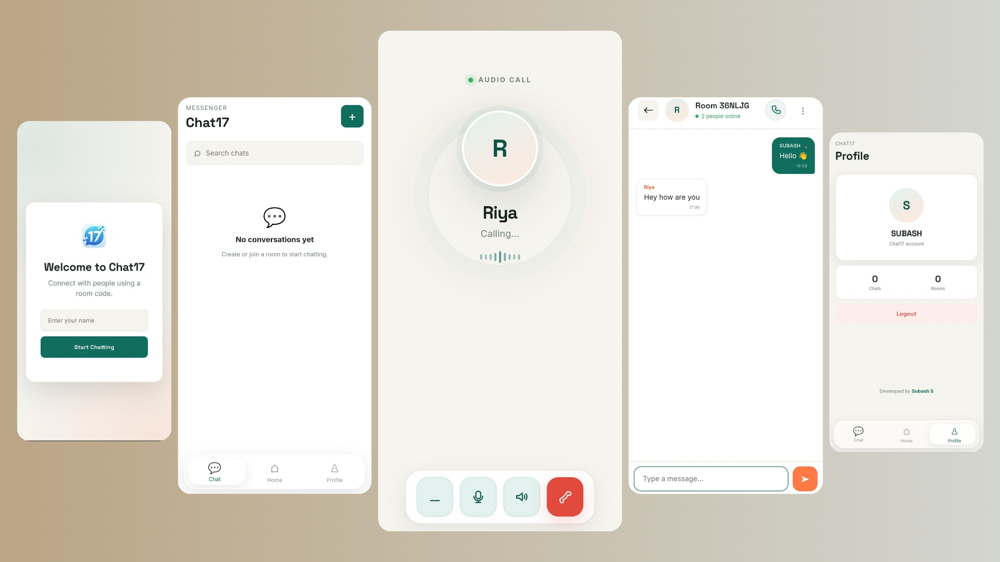

# Chat17

### Real-Time Chat Application

Chat17 is a modern real-time web chat application designed for simple, fast, and seamless communication between users.

<p align="center">
  
</p>

## ✨ Features

* 💬 **Real-Time Messaging** — Send and receive messages instantly.
* 👤 **User-to-User Chat** — Communicate directly with other users.
* ⌨️ **Typing Indicator** — See when another user is typing.
* 🔗 **Clickable Links** — URLs in messages can be opened directly.
* 🗑️ **Message Deletion** — Delete messages from conversations.
* ⚡ **Real-Time Communication** — Powered by Socket.IO.
* 📱 **Responsive Design** — Works across mobile, tablet, and desktop.
* 🎨 **Modern Interface** — Clean and simple chat experience.
* 🌐 **Browser-Based** — No separate application required.

## 🛠️ Built With

| Technology | Purpose                       |
| ---------- | ----------------------------- |
| HTML5      | Application structure         |
| CSS3       | Styling and responsive design |
| JavaScript | Frontend functionality        |
| Node.js    | Backend runtime               |
| Express.js | Web server                    |
| Socket.IO  | Real-time communication       |

## 💬 Real-Time Communication

Chat17 uses **Socket.IO** to provide instant communication between users.

```text
┌──────────┐
│  User A  │
└────┬─────┘
     │
     │  Sends Message
     ▼
┌───────────────┐
│   Chat17      │
│    Server     │
│               │
│ Node.js +     │
│ Socket.IO     │
└───────┬───────┘
        │
        │  Real-Time Delivery
        ▼
┌──────────┐
│  User B  │
└──────────┘
```

Messages and typing activity are transmitted in real time, allowing users to communicate without refreshing the page.

## 🎨 User Experience

Chat17 focuses on providing a:

* Simple interface
* Fast communication experience
* Responsive layout
* Interactive chat environment
* Clean and modern design

## 📱 Responsive Design

Chat17 is designed to work across different screen sizes:

* 📱 Mobile
* 📲 Tablet
* 💻 Laptop
* 🖥️ Desktop

## 🔗 Message Features

### Clickable Links

URLs shared in messages are detected and displayed as clickable links.

### Message Deletion

Users can remove messages from their conversations for a cleaner chat experience.

### Typing Indicators

Typing activity is communicated in real time, allowing users to know when another user is composing a message.

## 🌐 Live Demo

<p align="center">
  <a href="https://chat17-app.vercel.app/" target="_blank">
    <strong>🚀 Open Chat17</strong>
  </a>
</p>


## 👨‍💻 Author

**Subash S**

---

⭐ If you like **Chat17**, consider giving the repository a star.
